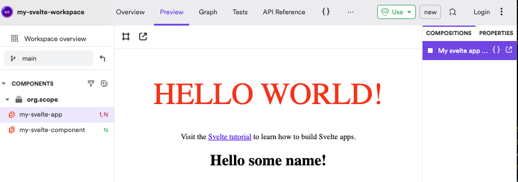

# Svelte on Bits demo

This project was generated using the [Bits Svelte frontend Getting started page](https://bit.cloud/frontend/svelte)

## Install Bit version manager (bvm)

```bash
yarn global add @teambit/bvm
```

Install bit CLI

```bash
bvm install
```

Create bit workspace for svelte project

```bash
bit new basic my-svelte-workspace
```

Enter workspace

```bash
cd my-svelte-workspace
```

Open in your IDE of choice

```bash
code .
```

```bash
bit templates

The following template(s) are available with the command bit create:
Example - bit create <template-name> <component-name>
svelte (frontend.svelte/svelte-env)
    svelte (a svelte component template)
    svelte-env (set up your own custom svelte env using this template)
    svelte-app (a template for generating svelte app components)

find and add templates in https://bit.dev/reference/generator/use-component-generator
```

Add a svelte component

`bit create svelte my-svelte-component`

Add a svelte app

`bit create svelte-app my-svelte-app`

Start local Bit dev server

`bit start`

Go to [localhost:3000](localhost:3000)



Notice how the component is imported and used in the Svelte app:

```svelte
<script>
    import { MySvelteComponent } from '@org/scope.my-svelte-component';
    export let name;
</script>

<main>
    <h1>Hello {name}!</h1>
    <p>Visit the <a href="https://svelte.dev/tutorial">Svelte tutorial</a> to learn how to build Svelte apps.</p>
    <MySvelteComponent
    name="some name"
    />
</main>
```
